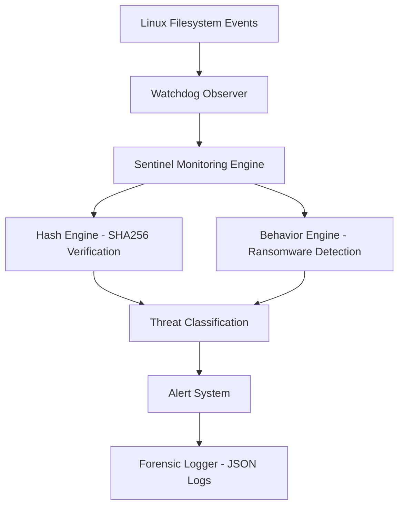

# Sentinel FIM 🛡️

### Real-Time File Integrity Monitoring & Behavioral Threat Detection for Linux


Sentinel FIM is a lightweight host-based security tool that continuously monitors filesystem activity and detects unauthorized system changes in real time.

The project demonstrates how modern endpoint protection and intrusion detection systems verify file integrity, maintain trusted baselines, and detect ransomware-like behavior through activity analysis.

---

## 🎬 Live Demonstration


---

## 🧭 Architecture



---

## 🚀 Features

* Real-time file monitoring using filesystem events
* Cryptographic file integrity verification (SHA-256)
* Trusted baseline creation and validation
* Baseline tamper detection
* Threat severity classification
* Behavioral detection for rapid file modification activity
* JSON forensic logging for incident investigation
* Linux background service support using systemd

---

## ⚙️ Installation

Clone repository:

```
git clone https://github.com/Garima040106/sentinel-fim.git
cd sentinel-fim
```

Create virtual environment:

```
python3 -m venv cyenv
source cyenv/bin/activate
```

Install dependencies:

```
pip install -r requirements.txt
```

---

## 🧩 Initialize Trusted Baseline

Create initial integrity snapshot:

```
python main.py --init
```

---

## ▶️ Run Sentinel

```
python main.py
```

Sentinel will begin monitoring configured directories in real time.

---

## 🧨 Attack Simulation

Run simulated attacker activity:

```
./attacks/simulate_attack.sh
```

This triggers:

* File creation
* Rapid modification
* Deletion events
* Ransomware-like behavior detection

---

## 📂 Project Structure

```
sentinel-fim/
│
├── fim/
│   ├── monitor.py
│   ├── hashing.py
│   ├── database.py
│   ├── alerts.py
│   ├── behavior.py
│   └── forensics.py
│
├── attacks/
├── docs/
│   └── demo.gif
│
├── baseline/
├── logs/
├── main.py
├── requirements.txt
└── README.md
```

---

## 🛠️ Technologies Used

* Python
* Watchdog (filesystem monitoring)
* SHA-256 hashing
* Linux systemd services
* JSON forensic logging

---

## 📌 Project Highlights

* Designed a real-time Linux File Integrity Monitoring system.
* Implemented cryptographic baseline validation using SHA-256 hashing.
* Built behavioral detection capable of identifying ransomware-like activity.
* Developed forensic logging for incident traceability.
* Deployed as a persistent Linux background security agent.

---

## ⚠️ Disclaimer

Sentinel FIM is an educational cybersecurity project created for learning and research purposes.
It is not intended to replace enterprise security solutions.

---

## 👩‍💻 Author

**Garima Varma**
Cybersecurity Undergraduate
Security Engineering & Defensive Systems Enthusiast
